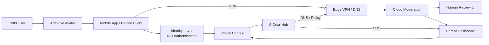

# Identity, System Architecture & Data Flow — SiGear MVP

## Overview

SiGear combines **identity-led safety**, **network-level enforcement**, and **cloud-supported moderation** into a single platform.

### Core Components

* **Identity Layer (NTI + Avatar):**
  Defines user permissions, authentication, interaction model, and context-aware guidance. This layer determines what the user is allowed to access and how the system responds.

* **Local Hub (SBC):**
  Gateway, DNS policy enforcement, local cache, SOS relay, and fallback protection if cloud services are unavailable.

* **Mobile App:**
  VPN client, safe-view renderer, avatar interaction layer, and local consent controls.

* **Edge / VPN Services:**
  UK-hosted relay endpoints and DNS resolver with policy engine.

* **Cloud Moderation Service:**
  Ingestion queues, automated classifiers, human review UI, and audit logs.

* **Parent Dashboard:**
  Web UI, role-based access, reporting APIs, safety signals, and governance controls.

---

## Architecture Principles

* **Identity defines behaviour**
  NTI determines permissions, mode, and safety context.

* **Network enforces boundaries**
  Hub and VPN infrastructure apply policy based on identity and environment.

* **Avatar translates policy into experience**
  Restrictions are presented as guided interaction, not just technical blocks.

* **Cloud services extend, not replace, local protection**
  Core protections continue even during cloud interruption.

---

## Simple Mermaid Network Diagram

---

## Data Flow Notes

### Identity and Access Flow

* Child selects avatar on device
* Device authenticates using NTI (passkey model)
* Identity layer determines active mode, permissions, and context
* Policy context is applied to app behaviour and network controls

### DNS and Traffic Flow

* Device traffic routes through Hub or Mobile VPN
* DNS requests are evaluated against:

  * policy store
  * identity context
  * device mode
* Requests are allowed, filtered, or redirected accordingly

### Guidance and Restriction Flow

* If restricted content is encountered:

  * avatar presents a child-friendly response
  * system redirects to approved alternatives where possible
* This reduces repeated access attempts and lowers user friction

### User Content Flow

* User content shared within safe-view or moderated environments is submitted to moderation pipeline with user or parent-controlled consent
* Moderation pipeline:

  * ingest
  * classify
  * review if required
  * publish / restrict / escalate

### Logging and Reporting Flow

* Local logs stored on Hub in encrypted form
* PII separated from analytics and stored in UK KMS-backed systems
* Dashboard receives only required safety events, alerts, and governance information

---

## Failure / Fallback Behaviour

* If cloud moderation or edge services are unavailable:

  * Hub continues enforcing local cached rules
  * identity-bound device rules remain active
  * avatar guidance remains available for child interaction
* This ensures continuity of protection even during service interruption

---

## APIs to Specify Next

* **Identity Policy API**
  Push identity-linked rules to Hub, App, and Edge services

* **Policy Management API**
  Manage profiles, modes, and network enforcement settings

* **Moderation Ingestion API**
  Secure upload, signed requests, review workflow triggers

* **Dashboard Reporting API**
  Safety signals, incident reporting, governance events

---

## To Do Next

* Produce detailed **sequence diagrams** for:

  * NTI authentication flow
  * avatar-guided restriction flow
  * moderation pipeline
  * SOS / emergency flow

* Produce API contracts for:

  * identity policy distribution
  * moderation pipeline
  * dashboard governance actions
