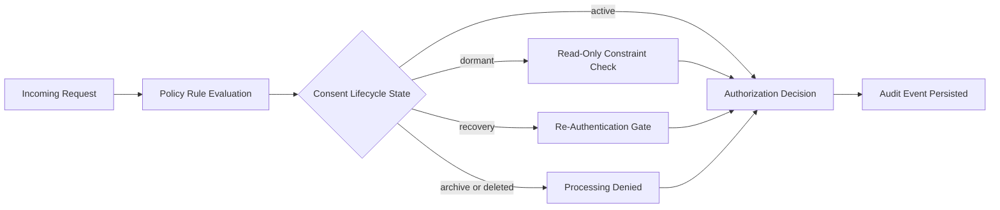

# SiGear Prototype Demo — Talk Track

This guide helps you walk stakeholders through the NTI prototype and explain what makes SiGear different.

## System Flow

Use this diagram early in the demo to show the decision path before stepping through the five scenarios.

What to say:

- Every request enters the same evaluation pipeline.
- SiGear checks both the policy rule and the current consent lifecycle state.
- The authorization result is explainable, then persisted as an audit event.

## Opening (30 seconds)

> "SiGear turns consent into something systems must obey—not something users have to trust."

> "SiGear is a digital identity system built on **consent as a living, enforceable contract**. Unlike traditional systems that grant broad permissions once and forget them, SiGear makes every data use auditable, reversible, and aligned to what a parent or young person actually consented to."

> "Let me show you five real scenarios and how SiGear responds."

---

## Scenario A: Safe Social Connection (Allowed)

**What happens:** A young person wants to connect with a friend in a safe moderation context.

**What SiGear does:** ✅ **Allowed**

**Why this matters:**

- **Guidance, not restriction**: SiGear doesn't block good uses. It enables safe social connection because that purpose is clearly stated in the consent agreement and the request matches the agreed capability level.
- **Transparent policy**: The consent record says "yes to safety moderation," so the system says yes.

---

## Scenario B: Model Training Request (Denied)

**What happens:** A data aggregator asks to use the young person's data for AI model training.

**What SiGear does:** ❌ **Denied** — "purpose 'model_training' is not allowed by policy rule"

**Why this matters:**

- **Purpose-driven consent**: The original consent didn't include training models. SiGear enforces the actual agreement, not a lawyer's interpretation of buried terms.
- **No silent reuse**: If the purpose changes, consent must change. Full stop.
- **Derivative control**: Even if the data seems "anonymized," SiGear knows that model training is a derivative use with downstream risks. The system enforces that boundary.
- **No dark patterns**: Platforms can't repurpose data without re-consent. This is what GDPR intended but couldn't technically enforce. SiGear does.

---

## Scenario C: Dormant State Write (Denied)

**What happens:** The same system tries to process or write back to the young person's data while their consent is dormant (like in the "digital safety" pause state).

**What SiGear does:** ❌ **Denied** — "consent is dormant; only read-only access is permitted" / "derivative creation is disabled"

**Why this matters:**

- **Lifecycle controls**: Real life has seasons. During a dormant period (recovery, digital detox, or safety review), the system respects that the young person has paused. Read-only is safe; writes and derivatives are not.
- **Real-world relevance**: Think of a child choosing to step back from digital life during a stressful period—such as exams, a personal loss, or needing time to reset. This isn’t about system failure; it’s about giving families control. Dormancy means the system pauses with them—not behind them.
- **No surprise processing**: Many systems keep crunching data in the background even after a user asks to pause. SiGear's lifecycle model makes dormancy actually mean something.
- **Auditability**: Every attempt to write during dormancy is logged, so parents and young people can see if a platform tried to cheat.

---

## Scenario D: Recovery Without Re-Authentication (Denied)

**What happens:** After dormancy, the system tries to resume processing without the young person confirming they want to resume.

**What SiGear does:** ❌ **Denied** — "consent is in recovery; re-authentication required before processing"

**Why this matters:**

- **Explicit restart, not sticky defaults**: Some systems auto-resume. SiGear requires an active choice. The young person or parent must confirm: "Yes, I'm ready to share again."
- **Safety by design**: This prevents accidental resumption and gives parents/guardians a checkpoint to review what data will be shared.

---

## Scenario E: Recovery With Re-Authentication (Allowed)

**What happens:** After the re-authentication decision, the same request is made again.

**What SiGear does:** ✅ **Allowed**

**Why this matters:**

- **Choice and control**: The young person made an informed choice to resume. SiGear honors that choice.
- **Parent-teen partnership**: If a parent and teen have discussed dormancy and recovery, this scenario reflects their agreement.

---

## The Audit Trail

**What you see at the end:** "Audit events recorded: 2"

**Why this matters:**

- **Full transparency**: Every decision—allow or deny—is recorded with reasons.
- **Accountability**: If a dispute arises ("Did you really deny my data?"), the audit log proves it.
- **Compliance-ready**: Regulators and parents can see exactly what happened and when.
- **No black box**: Traditional systems hide policy logic. SiGear publishes it.
- **Evidence, not claims**: SiGear doesn't say it protects users—it proves it, decision by decision.

---

## Closing (1 minute)

> "The five scenarios you just saw show SiGear's core value:
>
> 1. **Privacy**: Data uses are tied to explicit, auditable consent.
> 2. **Guidance**: We don't block—we enforce what was agreed.
> 3. **Lifecycle control**: Consent is a living thing, not a one-time checkbox.
> 4. **Auditability**: Every decision is recorded and reviewable.
> 5. **Modernization**: This is what 2026 digital identity should look like.
>
> And this is just the file-backed version running locally with no database. The production system adds real-time policy updates, cross-service enforcement, and delegation—all while keeping the same core promise: **consent you can trust.**"

> "This isn’t a new privacy policy. It’s a new expectation of how systems behave."

---

## For Technical Stakeholders

**Q: Is this production-ready?**

A: This is a credible prototype that demonstrates the core NTI model. It uses file-backed documents today (for rapid demos) and scales to a Postgres-backed source-of-truth policy system via a one-command migration (`npm run policy:postgres:switch`).

**Q: What about performance and scale?**

A: The prototype shows the logic. Production will add caching, pre-computed consent trees, and optimized DB indexes. The core evaluation engine is deterministic and designed to scale.

**Q: Can we integrate this into our platform?**

A: Yes. The policy-service exposes a REST API (`/v1/evaluate`) that any platform can call. Responses include obligations that apps use to enforce consent at runtime.

---

## Quick Talking Points (For Q&A)

| Topic | Talking Point |
|-------|---|
| Privacy | SiGear ties every data use to explicit consent. No surprises, no dark patterns. |
| Trust | Parents and teens both see exactly what data goes where and why. |
| Compliance | GDPR, COPPA, DPA, and similar regulations expect this. SiGear builds it in. |
| Modernization | Identity systems from 2010–2020 treat consent as one-time. SiGear treats it as a living contract. |
| Auditability | Every allow and deny is logged with reasons. Regulators and users can verify. |
| Fairness | Small platforms can use SiGear's policy engine. It's not locked into one large vendor. |
