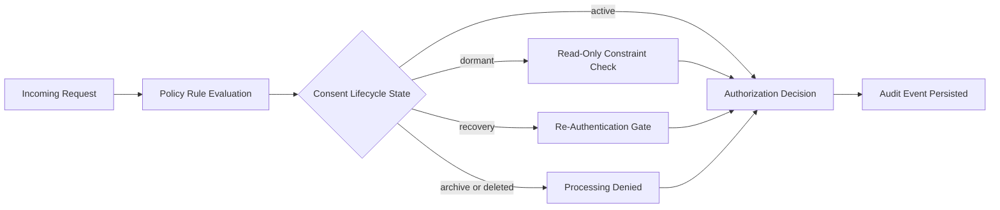

# SiGear Prototype Demo (No Postgres Required)

This is the smallest end-to-end NTI policy prototype path for stakeholder demos.

## Goal

Show that SiGear can:
1. Allow safe actions.
2. Deny unsafe data uses (for example model training).
3. Enforce lifecycle controls (`dormant`, `recovery`).
4. Produce audit records.

## One Command

From repository root:

```powershell
npm run prototype:demo
```

## What It Runs

The command executes:

- `packages/backend/services/policy-service/test/prototype.scenario.ts`

## Decision Flow



It uses file-backed policy documents and prints decisions for five scenarios:
1. Safe social connection request (allow).
2. Model training request (deny).
3. Dormant lifecycle write attempt (deny).
4. Recovery without re-authentication (deny).
5. Recovery with re-authentication (allow).

It also reports the number of audit events written.

## Why This Is Good For Early Demo

- No database setup required.
- Same evaluation core used by production path.
- Clean upgrade to Postgres mode later via migration and environment switch.

## Upgrade Path To Source-of-Truth Postgres

When you are ready:

```powershell
npm run policy:postgres:switch
```

Then start policy-service with postgres mode variables as printed by that script.

## Stakeholder Walkthrough

See [prototype-demo-talk-track.md](prototype-demo-talk-track.md) for a guided talk script that explains each scenario and connects it to SiGear's product promise.

## Acceptance Criteria

- Describe acceptance criteria for this prototype demo here.
- Demonstrates the five scenarios produce expected allow/deny decisions.
- Audit events are written and contain required metadata.
- No external DB required; script runs and exits cleanly.

